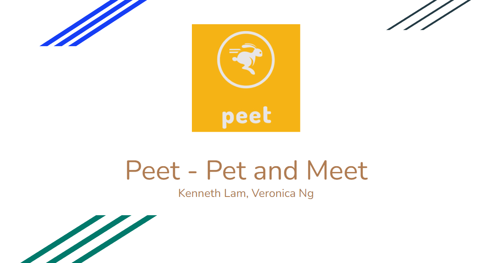
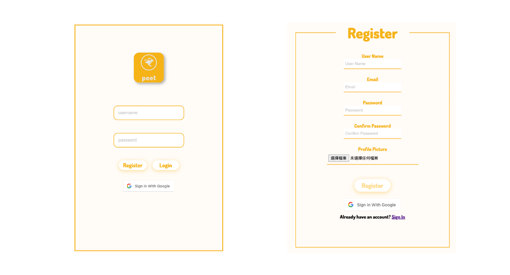
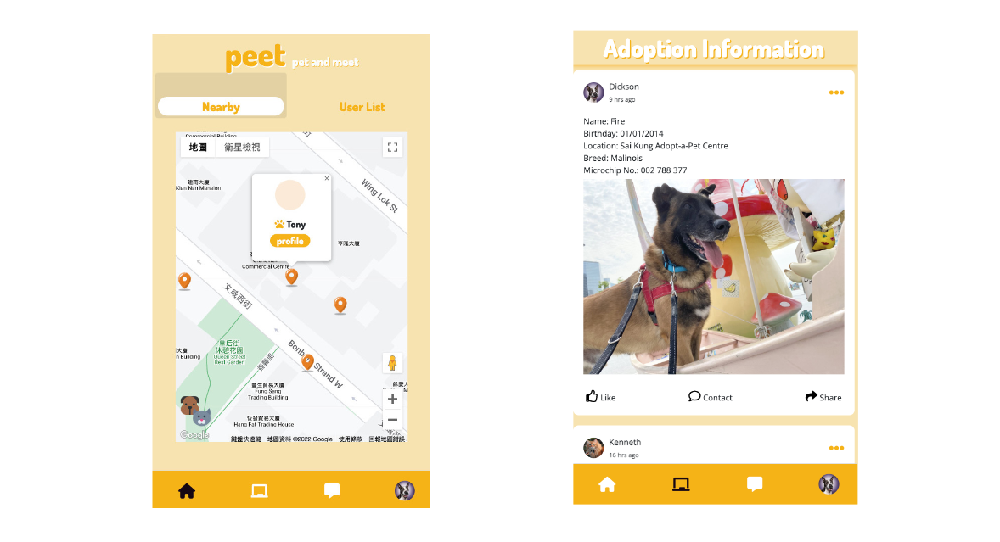
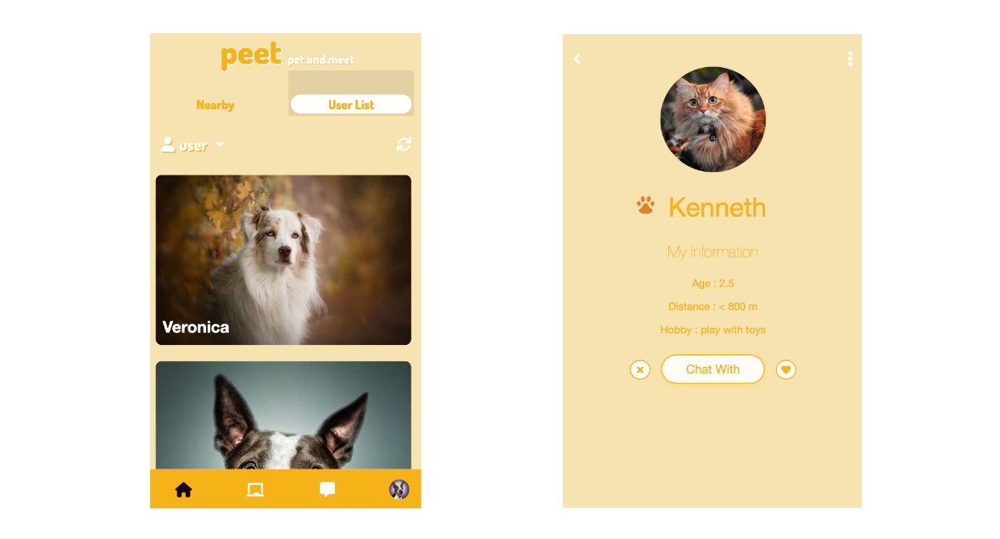
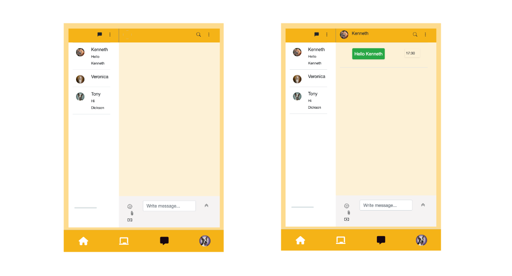

# Peet - Pet and Meet

A mobile website that can find the pet owners nearby and chat with them, also a post wall can share the pet daily with friends. 
When the user is online it will show a marker on another user’s map with basic information of their pets, if they want to have a deep conversation, the user can add a friend and start to chat with. 

More details :

https://docs.google.com/presentation/d/1xPW1P8DQ_WQr7mTe--xUCVBziDv-18NPGfijyc--CBU/edit?usp=sharing

 

## Screenshots

 

 

 

 

 

 

